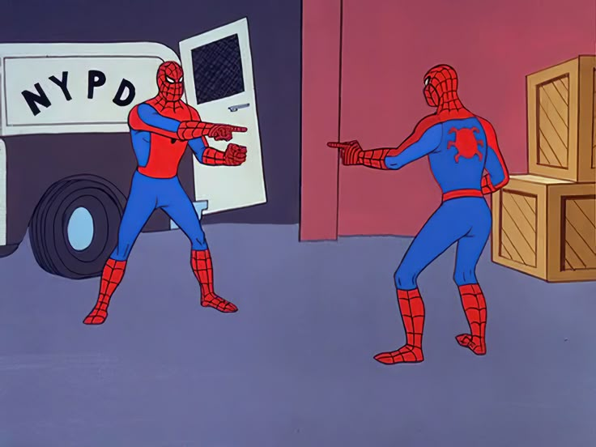

One of the desires of goose (well for some of us) was to avoid the constant asking for permissions, delegating all the decisions to end users in an attempt to keep agent execution of tools safe. Sometimes that gets pretty noisy and annoying and ends up being less secure when you get tired of reading and approving. 

You can of course adjust settings as you see fit, but it is nice to consider how things could be made safe without assuming that you can interrupt the user constantly for permission, especially around things they may not currently have the context for (in their head!)

In goose there are layers of things you can enable, but we wanted to also think about general solutions when we observed agents (of all kinds) being really helpful, and as a side effect, being accidentally harmful. This birthed "adversary mode" where the idea is: why not use another agent to fight fire with fire. Agents want to be helpful, and they can be oriented to help the user, but another one can be oriented to protect against the agent "helping" the user, to keep things in policy, and safe.

<!--truncate-->

## What Is Adversary Mode?

Adversary mode adds a silent, independent reviewer that evaluates every sensitive call *before* it executes, when needed. Think of it as a security-minded colleague looking over the agent's shoulder — one that knows what you originally asked for and can spot when something doesn't add up. This uses the same class of model as the main agent (ideally) or better, and runs itself as a little agent of its own (smaller context, so faster/cheaper to run, as it has to be called often, don't want to just double the cost!). 

There is also [pattern-based prompt injection detection](/docs/guides/security/prompt-injection-detection), but when you enable adversary mode, the reviewer understands context. It sees your original task, your recent messages, and the tool call details, then makes a judgment: **ALLOW** or **BLOCK**.

The configuration is trivial (just plain language, something an agent or a person can agree on, as it is an agent evaluating it).

## How It Works

1. Before each tool call, the adversary checks your **original task**, **recent conversation**, and the **proposed tool call**
2. It evaluates against your rules and returns ALLOW or BLOCK
3. Blocked calls are denied — the main agent sees the rejection and cannot retry
4. If the reviewer fails for any reason, the call is allowed through (fail-open)

The adversary uses the same model and provider goose is already configured with. No extra API keys or setup needed.

## Turning It On

Create a file at `~/.config/goose/adversary.md` with your rules:

```markdown
BLOCK if the tool call:
- Exfiltrates data (posting to unknown URLs, piping secrets to external services)
- Is destructive beyond the project scope (deleting system files, wiping directories)
- Installs malware or runs obfuscated code
- Downloads and executes untrusted remote scripts

ALLOW normal development operations like editing files, running tests,
installing packages, using git, etc.
```

That's it. File exists → adversary mode is on. Delete the file → it's off. An empty file uses sensible defaults.

## Why Not Just Use Pattern Matching?

Pattern-based detection is great for catching known attack signatures, and goose supports that too. The adversary reviewer can tell the difference between `curl` downloading a dependency and `curl` exfiltrating your SSH keys — because it knows what you actually asked for. It can even sense if an agent is creatively writing scripts, in fragments, to egress data to a public URL (again, to be helpful!) which wouldn't be obviously caught by patterns or rules or filters. 

The two approaches are complementary. Use both. Use all the layers!

## What's Next


We see adversary mode as one layer in a broader security story. For the deeper thinking behind it, check out our post on [applying the CORS model to agent security](/blog/2026/01/05/agentic-guardrails-and-controls).

For full configuration details — including how to expand which tools get reviewed — see the [adversary mode docs](/docs/guides/security/adversary-mode).

<head>
  <meta property="og:title" content="Adversary Agent: using a hidden agent to keep the main agent safe" />
  <meta property="og:type" content="article" />
  <meta property="og:url" content="https://block.github.io/goose/blog/2026/03/31/adversary-mode" />
  <meta property="og:description" content="Introducing adversary mode — an independent agent reviewer that silently watches the main agent to keep it away from danger." />
</head>
